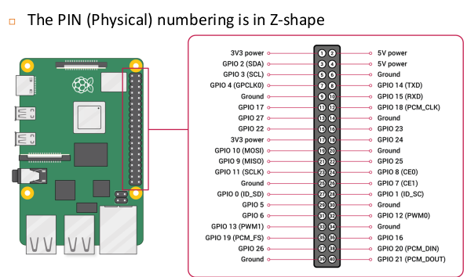

# GPIO

check gpio on Rpi:

```
pinout
```

## Basic

1. GPIO 輸入電壓不可超過 3.3 V
2. 金屬物體不可碰觸 GPIO pin 
3. 使用GPIO PIN啟動PI時, 電壓不可以超過5V

### 電阻計算

* [線上計算機: 小孩子才用手算](https://www.digikey.tw/zh/resources/conversion-calculators/conversion-calculator-resistor-color-code)
* 四色電阻:
    * 第一環: 十位數字
    * 第二環: 個位數字
    * 第三環: 加乘數, 電阻為: (第一環 concat 第二環) * 第三環
    * 誤差: 查表
* 五色電阻:
    * 第一環: 百位數字
    * 第二環: 十位數字
    * 第三環: 個位數字
    * 第四環: 加乘數, 電阻為: (第一環 concat 第二環 concat 第三環) * 第四環
    * 誤差: 查表

## GPIO.setmode

* ```GPIO.setmode(GPIO.BOARD)``` : 指定為板子上的 physical pins 號碼
* ```GPIO.setmode(GPIO.BCM)``` : 指定為 GPIO 的號碼



## GPIO.setup

* ```GPIO.setup(port_or_pin, GPIO.IN)```
* ```GPIO.setup(port_or_pin, GPIO.OUT)```

## GPIO.output

* ```GPIO.output(port_or_pin, 1)```
* ```GPIO.output(port_or_pin, HIGH)```
* ```GPIO.output(port_or_pin, 0)```
* ```GPIO.output(port_or_pin, LOW)```

## GPIO.clearup

* ```GPIO.cleanup()```
